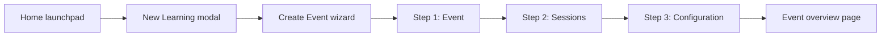

# Consolidated Event Creation

Highspot prototype for Humana / Event-Based Learning. Create an event, sessions, and essential configuration in one guided flow.

## Links

- **Repository:** https://github.com/anithvis-hs/event-creation-enhancement
- **Live prototype** (deployed from `main`): https://anithvis-hs.github.io/event-creation-enhancement/

## Persona and problem

**Persona:** Learning Administrator

**Problem:** Replace a disjointed event-creation flow with a single guided wizard that walks admins through event details, sessions, and essential configuration in one place.

## Prototype flow

### Key screens

- **Home launchpad** — entry point with "Create Event" CTA and reset demo
- **New Learning modal** — learning type picker (Event selected by default)
- **Create Event wizard** — three steps:
  1. **Event** — title, description, spot, banner, contact
  2. **Sessions** — add/edit virtual sessions with Zoom, Teams, or Meet integration UI
  3. **Configuration** — enrollment, registration, and attendance settings
- **Event overview** — post-creation landing page with tabs (Overview implemented; other tabs are placeholders)

## In scope

- Guided event + sessions + essential configuration flow
- Virtual session setup with Zoom / Teams / Meet integration UI
- Local state persistence via `localStorage` (`hs-event-create-v1`)

## Out of scope

- Backend/API integration
- Enrollment, Registration, Reports tabs (placeholders only)
- Full Settings editors
- Event Completion / Roles / Messages / Notifications
- Legacy flow comparison

## Project structure

| File | Purpose |
|------|---------|
| `index.html` | GitHub Pages entry point (synced from latest prototype) |
| `2026-06-17 - event-creation-enhancement-prototype.html` | Versioned source prototype |
| `.nojekyll` | Disables Jekyll for GitHub Pages |
| `.gitignore` | Ignores `.DS_Store` |

## Run locally

Open `index.html` or the dated prototype file directly in a browser. No build step or dependencies to install — the prototype uses CDN-hosted fonts and icons.

## Branch workflow

| Branch | Purpose |
|--------|---------|
| `dev` | Active development; push changes here first |
| `main` | Production; GitHub Pages deploys from here |

Merge `dev` → `main` when ready to publish live updates to GitHub Pages.
